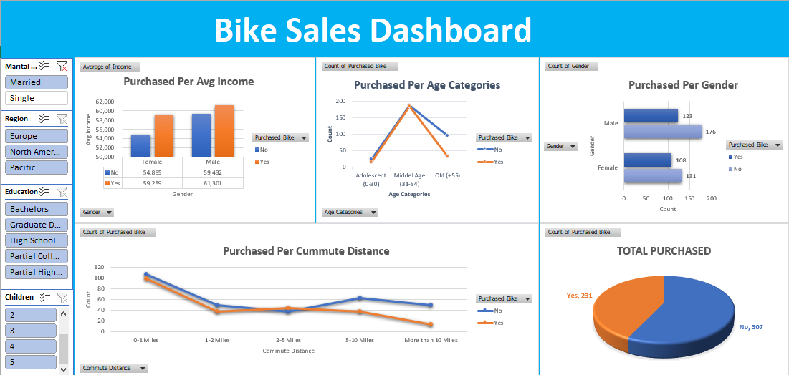

# BikeBuyers_DataAnalysis_ExcelProject

This Excel project is dedicated to data analysis, focusing on cleaning the "Bike Buyers" dataset and creating a dynamic dashboard to visualize insights effectively.

## Steps Taken:

### 1. Data Cleaning:
   - **Remove duplicates**: Ensured data integrity by eliminating duplicate entries.
   - **Standardize Marital Status, Gender, and Income**: Homogenized categorical data for consistency.
   - **Added "Age Categories" Column**: Enhanced analysis by categorizing ages into groups for better understanding.

### 2. Pivot Table Building:
   - **Purchased Per Avg Income**: Analyzed purchase behavior based on average income levels.
   - **Purchased Per Commute Distance**: Explored purchasing trends related to commuting distance.
   - **Purchased Per Age Categories**: Investigated purchasing patterns across different age groups.
   - **Purchased Per Gender**: Examined purchasing behavior by gender.
   - **Total Purchased**: Provided an overview of total purchases made.

### 3. Dynamic Dashboard Building:
   - Developed an interactive dashboard to visually represent key insights derived from the dataset.

Feel free to explore the repository and delve into the data analysis process. Happy analyzing! 🚲📊
